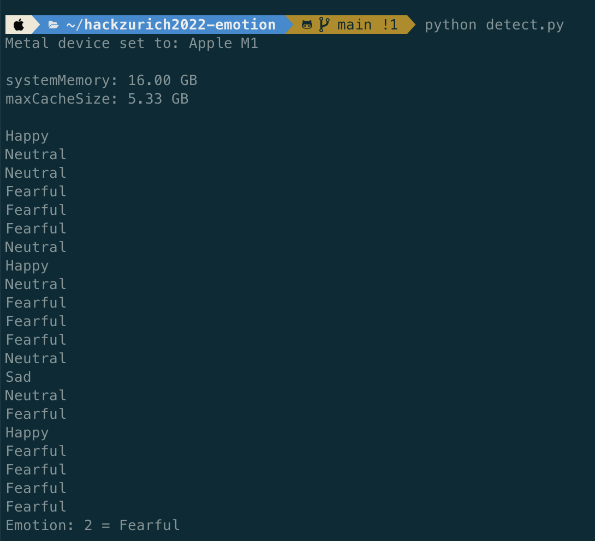
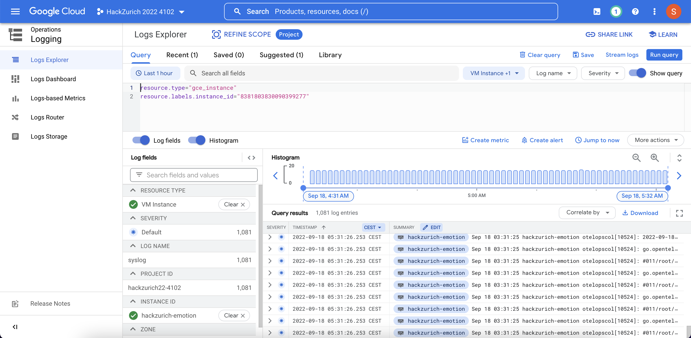
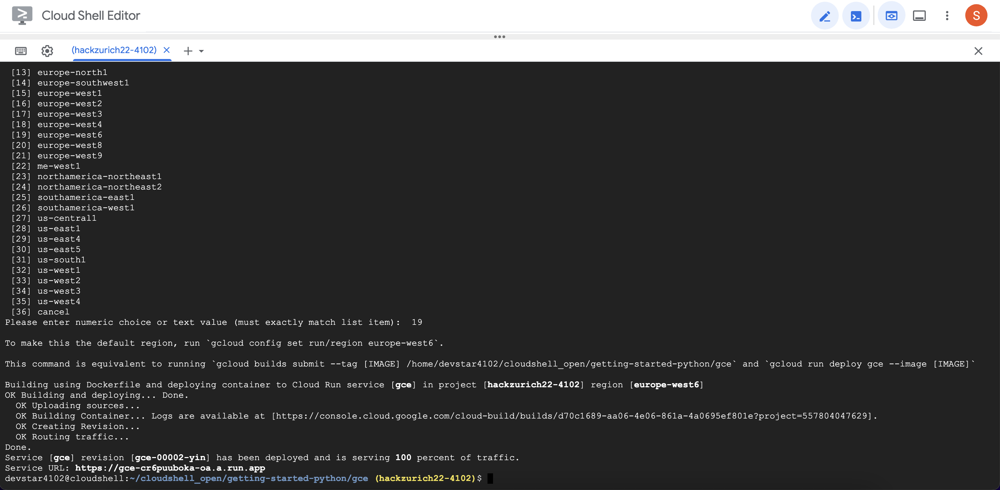

# hackzurich2022-emotion

ML algorithm for emotion detection for HackZurich 2022 project

## ML model

A pretrained model (`model.h5`) was trained on the FER-2013 dataset, to classify the emotion on a person's face into one of seven categories, using deep convolutional neural networks. The FER-2013 dataset consists of 35887 grayscale, 48x48 sized face images with seven emotions - angry, disgusted, fearful, happy, neutral, sad and surprised.

We trained a model using compute engine on Google cloud provided by Google Zurich.



## Deployment

Create a compute engine

```sh
MY_INSTANCE_NAME="my-app-instance"
ZONE=us-central1-a

gcloud compute instances create $MY_INSTANCE_NAME \
    --image-family=debian-10 \
    --image-project=debian-cloud \
    --machine-type=g1-small \
    --scopes userinfo-email,cloud-platform \
    --metadata-from-file startup-script=startup-script.sh \
    --zone $ZONE \
    --tags http-server
```

Set firewall

```sh
gcloud compute firewall-rules create default-allow-http-8080 \
    --allow tcp:8080 \
    --source-ranges 0.0.0.0/0 \
    --target-tags http-server \
    --description "Allow port 8080 access to http-server"
```



1. Enable API
2. Open app in Google Console Run
3. Run
    ```sh
    gcloud config set project PROJECT_ID
    gcloud run deploy
    ```



Go to the external link
